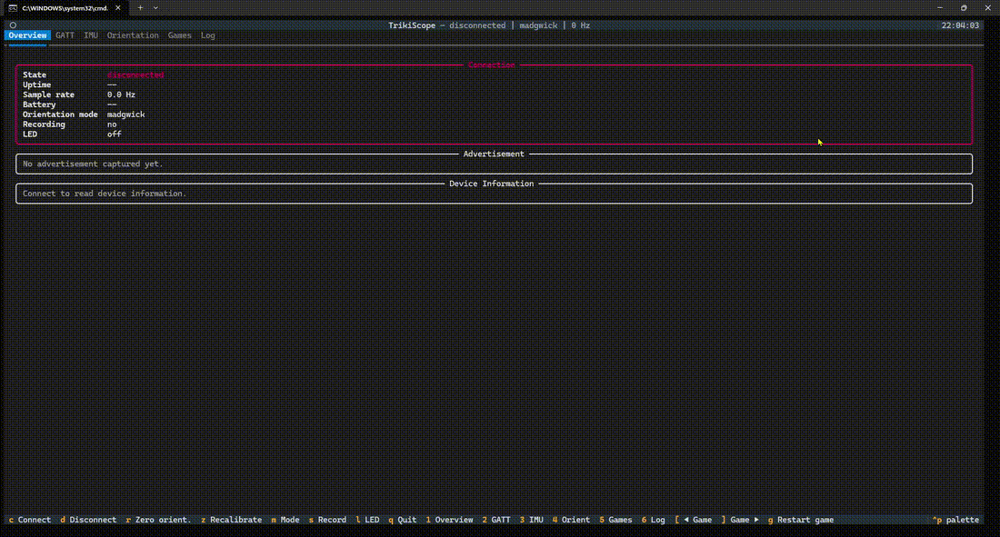

# TrikiScope

Otwarty, terminalowy (TUI) odczytywacz i inspektor BLE dla urządzenia **Żabka Triki**,
napisany w Pythonie — z naciskiem na **maksymalnie dużo informacji** o urządzeniu.

**Triki** od Żabki to mały kontroler do gier mobilnych w kształcie kapsla, działający
z aplikacją Żappka. Służy do sterowania grami ruchem (za wyniki można zdobywać żappsy,
zniżki i nagrody w ekosystemie Żabki). W środku ma czujnik IMU (żyroskop + akcelerometr),
dzięki czemu wykrywa obracanie, przechylanie i podrzucanie. Łączy się ze smartfonem przez
Bluetooth Low Energy.

TrikiScope łączy się z kapslem przez BLE, czyta z niego wszystko, co się da, dekoduje
strumień IMU i wizualizuje orientację 3D w czasie rzeczywistym.



## Co pokazuje

Bogaty dashboard w terminalu (Textual/Rich) z zakładkami:

- **Overview** — stan połączenia, czas połączenia (uptime), dane reklamowe BLE
  (RSSI, moc nadawania, `manufacturer data` z dekodowaniem Company ID, service
  UUIDs, service data), pełne informacje o urządzeniu (producent, model, numer
  seryjny, wersje firmware/hardware/software, System ID, PnP ID, MTU, Device ID
  z nazwy), poziom baterii oraz stan diody LED.
- **GATT** — pełna inwentaryzacja bazy GATT: usługi → charakterystyki →
  deskryptory, z właściwościami (read/write/notify/indicate), uchwytami i
  odczytanymi wartościami (tekst + hex). Wybrane wartości są dekodowane
  „po ludzku" (parametry połączenia, PnP ID, appearance, bateria itp.).
- **IMU** — strumień na żywo: surowe `int16` oraz przeliczone wartości gyro
  (deg/s) i accel (g), magnitudy, sparkline'y aktywności, statystyki strumienia
  (liczba powiadomień, ramek, gubione bajty, przerwy, częstotliwość próbek,
  histogram rozmiarów pakietów, przepustowość) oraz hex ostatniej ramki.
  Panel **Motion**: stan przycisku + licznik naciśnięć, wykryte gesty
  (TAP/IMPACT, FREE-FALL/THROW, SHAKE, SPIN) oraz szczytowe wartości gyro/accel.
- **Orientation** — orientacja 3D liczona filtrem **Madgwick AHRS** (lub
  komplementarnym), wizualizowana obracającym się szkieletem sześcianu w ASCII,
  kąty pitch/roll/yaw i kwaternion. Auto-kalibracja przy starcie strumienia.
- **Games** — kilka prostych gier ASCII sterowanych kapslem (na żywo, na tym
  samym strumieniu IMU): **Tilt Maze** (przechylaniem prowadzisz kulkę do celu),
  **Spin Meter** (jak najszybciej zakręć kapslem — pomiar szczytowej prędkości
  obrotowej) i **Reflex Catch** (test refleksu: zareaguj tapnięciem/przyciskiem
  na sygnał). Klawiszami `[` / `]` przełączasz grę, `g` restartuje bieżącą.
- **Log** — przewijalny dziennik zdarzeń (połączenie, przycisk, gesty, LED…).

Dane można zapisywać do **CSV** (strumień IMU + kąty + stan przycisku) i
**logu zdarzeń**. Diodą LED na kapslu można sterować klawiszem `l`.

## Wymagania

- Windows 10/11 z włączonym Bluetooth (działa też na Linux/macOS dzięki `bleak`),
- Python 3.10+,
- Włączone urządzenie Triki w pobliżu (jeśli śpi — naciśnij przycisk na kapslu
  tuż przed połączeniem).

## Instalacja

```powershell
cd TrikiScope
python -m venv .venv
.\.venv\Scripts\python.exe -m pip install -r requirements.txt
```

> Uwaga: nie musisz aktywować środowiska (`Activate.ps1`). Jeśli aktywacja
> otwiera plik w Notatniku, to znak, że jesteś w `cmd`/Eksploratorze, a nie w
> PowerShell — wtedy po prostu używaj `.venv\Scripts\python.exe` bezpośrednio
> albo launchera poniżej.

## Uruchomienie

Najprościej launcherem (bez aktywacji venv):

```powershell
.\run.ps1                 # PowerShell – z auto-połączeniem
```

```cmd
run.bat                   :: cmd / dwuklik w Eksploratorze – z auto-połączeniem
```

Albo bezpośrednio przez moduł:

```powershell
.\.venv\Scripts\python.exe -m trikiscope --auto-connect
```

Bez auto-połączenia (naciśnij `c` w aplikacji, by połączyć):

```powershell
.\.venv\Scripts\python.exe -m trikiscope
```

Jeśli kapsel śpi — naciśnij na nim przycisk tuż przed łączeniem, aby go wybudzić.

### Skróty klawiszowe

| Klawisz | Akcja |
|--------|-------|
| `c` | Połącz (skanuj + połącz) |
| `d` | Rozłącz |
| `r` | Wyzeruj orientację w bieżącej pozie |
| `z` | Rekalibracja (przytrzymaj nieruchomo) |
| `m` | Przełącz filtr orientacji (Madgwick / komplementarny) |
| `s` | Włącz/wyłącz nagrywanie do CSV |
| `l` | Zapal/zgaś diodę LED na kapslu |
| `1`–`6` | Przełącz zakładkę (Overview / GATT / IMU / Orientation / Games / Log) |
| `[` / `]` | (Games) Poprzednia / następna gra |
| `g` | (Games) Restart bieżącej gry |
| `q` | Wyjście |

### Tryb skanowania (bez TUI)

Wypisuje wszystkie reklamujące się urządzenia BLE (przydatne do znalezienia nazwy/adresu):

```powershell
.\run.ps1 --scan
```

### Wybrane opcje

```
--name TEXT           fragment nazwy urządzenia (domyślnie "Triki")
--scan-timeout SEC    czas skanowania (domyślnie 30)
--gyro-scale FLOAT    LSB na deg/s (domyślnie 131.0)
--accel-scale FLOAT   LSB na g (domyślnie 2048.0)
--settle-delay SEC    odczekaj N s przed wysłaniem komendy startowej (domyślnie 0)
--discard N           liczba początkowych próbek do odrzucenia (domyślnie 20)
--start-command HEX   komenda startowa na NUS RX (domyślnie 201000D007680003)
--no-start            nie wysyłaj komendy startowej automatycznie
--auto-connect        połącz się zaraz po starcie
--mode {madgwick,complementary}   filtr orientacji (domyślnie madgwick)
--record              nagrywaj od razu
--csv PATH / --log PATH   ścieżki plików wyjściowych
--scan                wypisz urządzenia BLE i zakończ (bez TUI)
```

Pełną listę zobaczysz przez `.\run.ps1 --help`.

## Specyfikacja BLE

Urządzenie korzysta z **Nordic UART Service** do komunikacji:

- Service UUID: `6e400001-b5a3-f393-e0a9-e50e24dcca9e`
- RX Characteristic (zapis, telefon → urządzenie): `6e400002-b5a3-f393-e0a9-e50e24dcca9e`
- TX Characteristic (powiadomienia, urządzenie → telefon): `6e400003-b5a3-f393-e0a9-e50e24dcca9e`

Aplikacja subskrybuje powiadomienia z TX i wysyła komendę inicjującą przesył danych do RX:

```text
20 10 00 D0 07 68 00 03
```

Dodatkowo w usłudze NUS jest charakterystyka `6e400004-…` (read/write). Odkryliśmy
przez eksperyment na żywo, że jej **bit 0 steruje diodą LED** na kapslu (`01` = świeci,
`00` = zgaszona; wartość jest maskowana do 1 bitu). Klawisz `l` w aplikacji zapala/gasi LED.

## Format danych IMU

Dane IMU przychodzą jako ramki **14-bajtowe** z nagłówkiem `22 00`:

```text
22 00 | gyroX | gyroY | gyroZ | accelX | accelY | accelZ
```

Każda oś to 16-bitowa liczba całkowita ze znakiem w formacie little-endian.
Domyślne przeliczniki skalowania sprzętowego: `131.0` dla żyroskopu (LSB na deg/s)
i `2048.0` dla akcelerometru (LSB na g).

**Drugi bajt nagłówka to flaga przycisku** (odkryte przez nasłuch BLE z naciskaniem
przycisku): `22 00` = przycisk puszczony, `22 01` = przycisk wciśnięty. Payload jest
identyczny w obu przypadkach. TrikiScope parsuje oba nagłówki, więc nie gubi ramek
podczas wciśnięcia, i pokazuje stan przycisku oraz licznik naciśnięć.

Analiza przechwyconego ruchu BLE i aplikacji Żappka `4.37.0` wskazuje, że strumień
przychodzi burstami BLE, zwykle po kilka ramek w krótkim pakiecie. TrikiScope używa
timestampów powiadomień BLE jako źródła czasu próbek (eksperymentalny stały zegar ok.
`104 Hz` dawał gorszą płynność w praktyce). Parser re-synchronizuje się po nagłówku
(`22 00` lub `22 01`), więc odzyskuje strumień po sklejonych/uciętych powiadomieniach
i nie gubi ramek z wciśniętym przyciskiem.

Przy starcie strumienia urządzenie emituje krótki "szum" — pierwsze próbki (domyślnie 20)
są odrzucane.

## Orientacja

Orientacja jest liczona dwoma wymiennymi filtrami (przełączane klawiszem `m`):

- **Madgwick AHRS** — fuzja gyro + accel do kwaternionu, z auto-kalibracją (auto-zero
  w spoczynku), wygładzaniem SLERP i wizualnym martwym polem.
- **Komplementarny** — bezpośrednie pitch/roll/yaw z filtru komplementarnego
  (tryb „Zappka-like”).

## Sprzęt

Triki opiera się na:

- **MCU:** Nordic Semiconductor nRF52810 (BLE),
- **IMU:** ST LSM6DSL (akcelerometr + żyroskop),
- **Flash zewnętrzny:** Macronix MX25R8035F (8 Mbit / 1 MB, SPI),
- **Debug:** piny SWD na PCB; urządzenie chronione **Nordic APPROTECT**
  (odczyt firmware/debug zablokowany bez pełnego wymazania chipu).

Szczegółowe notatki sprzętowe (pinout, zdjęcia PCB, OpenOCD/SWD, zrzut flasha) znajdują
się w osobnym projekcie: <https://github.com/Piwencjusz/zabka-triki-hardware>.

## Narzędzia diagnostyczne (`tools/`)

Pomocnicze skrypty użyte przy reverse-engineeringu urządzenia (uruchamiane
osobno, gdy aplikacja TUI jest zamknięta):

- `diagnose.py` — pełny zrzut: reklama, GATT z wartościami, analiza strumienia.
- `probe_button.py` — interaktywny test wykrywający ramki przycisku (`22 01`).
- `probe_led.py` — potwierdza sterowanie diodą (wzorzec mrugania).
- `probe_write_vendor.py` — bezpieczny (read-modify-restore) test zapisu do `6e400004`.
- `probe_ble_layer.py` — test produkcyjnej warstwy BLE end-to-end.

```powershell
.\.venv\Scripts\python.exe tools\diagnose.py
```

## Testy

```powershell
.\.venv\Scripts\python.exe -m pip install pytest
.\.venv\Scripts\python.exe -m pytest
```

## Projekt siostrzany — TrikiEmu

**[TrikiEmu](https://github.com/Maku-hub/TrikiEmu)** to odwrotność TrikiScope: zamiast *czytać* kapsel, **udaje go**. ESP32 w roli
BLE *peripheral* odtwarza tożsamość i profil Triki (reklama, NUS, strumień IMU), dzięki czemu
aplikacja Żappka łączy się z nim jak z prawdziwym kapslem, a ruch podaje się z komputera.
TrikiScope jest BLE *centralem* (klient), TrikiEmu — *peripheralem* (serwer); cała wiedza
o protokole pochodzi z reverse-engineeringu zrobionego tutaj. TrikiScope pełni też rolę
**znanego-dobrego centrala do walidacji** emulatora, zanim ten trafi do appki Żabki.

## Zastrzeżenie

Projekt służy celom edukacyjnym i dokumentacyjnym. Nie jest powiązany z firmą Żabka.
